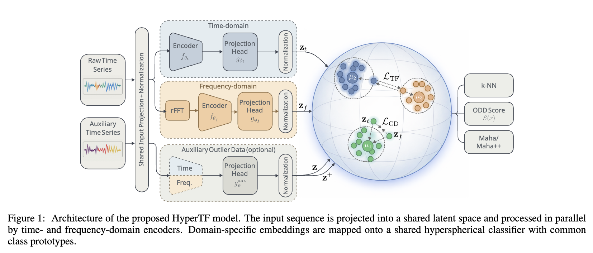
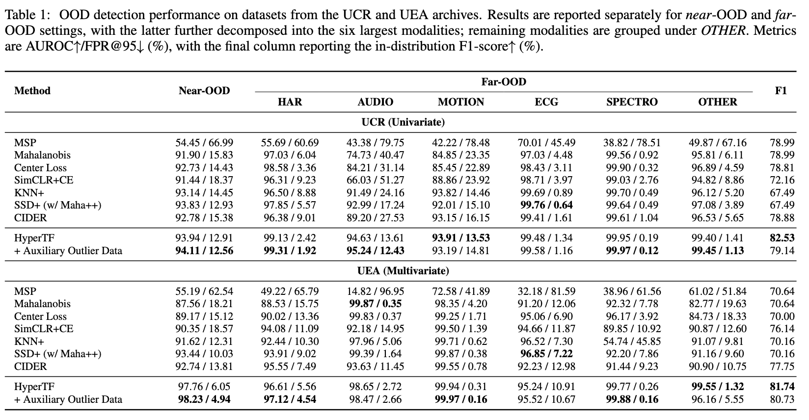
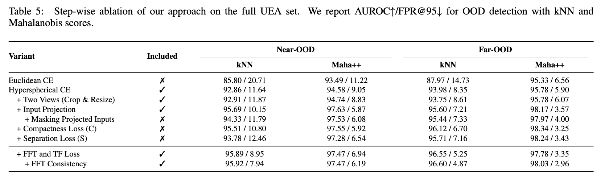

<div align="center">

# Learning Hyperspherical Time-Frequency Representations for Time-Series Out-of-Distribution Detection

[](https://www.python.org/downloads/release/python-3119/) [](https://opensource.org/licenses/MIT) [](https://arxiv.org/abs/2605.31155)

</div>



> **Abstract:**
>
> Out-of-distribution (OOD) detection for time-
> series data remains comparatively underexplored
> compared to vision and language, with a limited
> principled understanding of how supervised time-
> series representations can be leveraged for reliable
> detection under distributional shifts. This work
> formulates time-series OOD detection within a
> representation-learning framework based on hyper-
> spherical embeddings, in which class-conditional
> structure is induced by a von Mises–Fisher like-
> lihood–based objective on the unit sphere. The
> learned representation combines time-domain and
> frequency-domain representations of the input sig-
> nal, obtained via distinct domain-specific encoders,
> and integrates them into a joint embedding space
> for OOD detection. Detection is performed using
> distance-based scoring functions defined over the
> learned embeddings, including k-NN and Maha-
> lanobis scores. The proposed approach is evaluated
> at scale on the complete UCR and UEA time-series
> archives under a cross-dataset protocol. Empirical
> results demonstrate that the resulting models con-
> sistently improve OOD detection performance un-
> der both k-NN and Mahalanobis scoring, compared
> with strong contrastive-learning and post-hoc base-
> lines evaluated in the same experimental setting.

## Setup

a. Use `Docker` (Recommended)

```bash
bash scripts/build_docker.sh
bash scripts/run_docker.sh  # you will be inside the docker env with all reqs already installed
```

b. Or, install with `pip` in a `virtualenv` / `conda` env:

```bash
python -m venv venv
source venv/bin/activate
pip install -r requirements.txt
```

## Experiment scripts

 UCR and UEA datasets are autodownloaded by the training scripts. The training takes a lot of time (6-8 hours) since we run 3 seeds on each configuration across 128 UCR and 30 UEA datasets. To reduce training time, run on a system with a higher number of GPUs and increase parallel GPU runs with `--ngpus NGPUS` for the experiment scripts.

### Main table hypertf results

```bash
# Run HyperTF experiments
# Use --ngpus NGPUS to increase number of parallel GPU experiment runs
python scripts/exp_scripts/main_table/exp_hypertf.py

# Run HyperTF with auxiliary outlier data experiments (Runs both the near & far OOD case)
python scripts/exp_scripts/main_table/exp_hypertf_aux_outlier.py

# Run HyperTF with MixOE experiments (Runs both the near & far OOD case)
python scripts/exp_scripts/main_table/exp_hypertf_mixup_oe.py

# Generate main result table using:
python scripts/postprocess/near_far_ood_method_table_per_OOD_group.py main_table
```



### Ablation table fft results

```bash
# Run ablation table FFT experiments, runs three runs on two 2 gpus, GPU runs can be changed inside
python scripts/exp_scripts/ablation/exp_fft.py

# Generate ablation table fft results with
python scripts/postprocess/near_far_ood_method_table_per_OOD_group.py main_table/hyper_tf ablation
```



## Train

To run training with the proper parameters refer to the values used in `scripts/exp_scripts`. Default values in the config files may not generate the best results.

```bash
# UCR training
python train.py --cfg configs/contrastive/ucr_supcon_hyper.yaml --dataset ECG200
# UEA training
python train.py --cfg configs/contrastive/uea_supcon_hyper.yaml --dataset Epilepsy

# Overrides can be passed with -o
# list overrides passed with [i] indexing
python train.py --cfg configs/contrastive/ucr_supcon_hyper.yaml -o loss.args.losses[0].args.temperature=0.01
```

## Data

The Data is automatically downloaded during training from aeon datasets. The datasets should then be arranged in the `data/` folder in the following way:

* [128 UCR datasets](https://www.cs.ucr.edu/~eamonn/time_series_data_2018) should be put into `data/UCR/` so that each data file can be located by `data/UCR/<dataset_name>/<dataset_name>_*.csv`.
* [30 UEA datasets](http://www.timeseriesclassification.com) should be put into `data/UEA/` so that each data file can be located by `data/UEA/<dataset_name>/<dataset_name>_*.arff`.

## Dev Tests

```bash
pip install -r tests/requirements.txt
# Currently tests may not match if python version != 3.11.9
pytest tests
# to regenerate and sync test fixtures for the integrations tests
# WARNING: Only do this if sure the test acc/f1/auroc/fpr results should change
python tests/reset_integration_test_fixtures.py
```

## Citation

If you find this work or code useful for your research, please cite our paper:

```bibtex
@inproceedings{lunardi2026learning,
  title={Learning Hyperspherical Time--Frequency Representations for Time-Series Out-of-Distribution Detection},
  author={Lunardi, Willian T. and Shrestha, Samridha and Andreoni, Martin},
  booktitle={Proceedings of the International Joint Conference on Artificial Intelligence (IJCAI)},
  year={2026}
}
```
